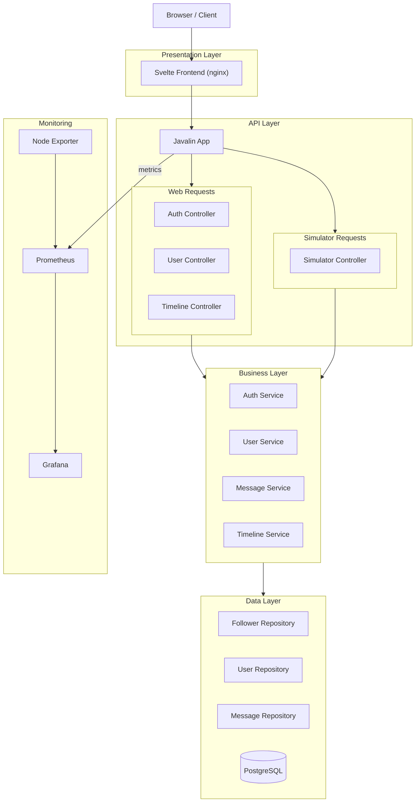

> A Twitter clone built and deployed as part of the DevOps course at ITU (Spring 2026).

🔗 **Live:** [zerodt.live](http://zerodt.live) 

[](https://app.codacy.com/gh/ZeroDownTime-ITU/minitwit_project/dashboard?utm_source=gh&utm_medium=referral&utm_content=&utm_campaign=Badge_grade)

---

## Table of Contents

- [About](#about)
- [Tech Stack](#tech-stack)
- [Architecture](#architecture)
- [Getting Started](#getting-started)
- [CI/CD Pipeline](#cicd-pipeline)
- [Monitoring & Logging](#monitoring--logging)
- [API Documentation](#api-documentation)
- [Repository Structure](#repository-structure)
- [Contributing](#contributing)
- [Team](#team)

---

## About

MiniTwit is an old Python app we've rebuilt using Java, Docker, and modern DevOps tools. It runs in production on DigitalOcean with automated deployments, monitoring, and the whole pipeline.

---

## Tech Stack

| Layer          | Technology                     |
|----------------|--------------------------------|
| Backend        | Java (Javalin)                 |
| Frontend       | Svelte                         |
| Database       | PostgreSQL                     |
| Reverse Proxy  | nginx                          |
| Containerization | Docker / Docker Compose      |
| CI/CD          | GitHub Actions                 |
| Monitoring     | Prometheus & Grafana           |
| Infrastructure | DigitalOcean                   |
| Provisioning   | Vagrant                        |

---

## Architecture


Brief description of how the components interact here.

---

## Getting Started

### Prerequisites

- Docker & Docker Compose
- Git

### Run Locally
```
TODO: This is just a template update it
```
```bash
git clone https://github.com/<org>/minitwit.git
cd minitwit
docker-compose up --build
```

The application will be available at `http://localhost:<port>`.

---

## CI/CD Pipeline

Our GitHub Actions workflow handles:

1. **Build** — Compile and build Docker images
2. **Test** — Run unit and integration tests
3. **Deploy** — Push images and deploy to DigitalOcean droplet

---

## Monitoring & Logging

- **Prometheus** collects metrics from the application and infrastructure
- **Grafana** dashboards visualize key metrics

### Key Metrics Tracked
```
TODO: This is just a template update it 
```

- Request rate and latency
- Error rates (HTTP 4xx/5xx)
- System resource usage (CPU, memory)
- Database query performance

### Access

- Grafana: [zerodt.live/grafana](https://zerodt.live/grafana/) 

---

## API Documentation
```
TODO: This is just a template update it 
```
The simulator API exposes the following endpoints:

| Method | Endpoint              | Description                |
|--------|-----------------------|----------------------------|
| GET    | `/public`             | Public timeline            |
| GET    | `/msgs`               | Get messages                |
| GET    | `/msgs/<username>`    | Get messages for user       |
| POST   | `/msgs/<username>`    | Post a message              |
| GET    | `/fllws/<username>`   | Get follows for user        |
| POST   | `/fllws/<username>`   | Follow/unfollow a user      |
| POST   | `/register`           | Register a new user         |
| GET    | `/latest`             | Get latest processed command|

<!-- Expand with request/response examples if needed -->

---

## Repository Structure


```
minitwit/
├── src/                    # Backend source code (Javalin)
├── frontend/               # Svelte frontend
├── docker-compose.yml      # Container orchestration
├── Dockerfile              # Application container
├── nginx/                  # Reverse proxy configuration
├── prometheus/             # Prometheus config
├── grafana/                # Grafana dashboards & provisioning
├── .github/workflows/      # CI/CD pipeline definitions
├── deploy.sh               # Deployment script
├── provision.sh            # Provisioning script
├── Vagrantfile             # Vagrant setup
└── README.md
```

---

## Contributing
```
TODO: This is just a template update it 
```
1. Create a feature branch from `main`: `git checkout -b feature/my-feature`
2. Commit with descriptive messages
3. Open a Pull Request for review
4. At least one team member must approve before merge

<!-- Add any branch naming conventions, commit message format, etc. -->

---

## Team

**Team ZeroDownTime** - ITU DevOps Spring 2026

- Mathias
- Corbijn
- Magnus
- Kasper
- Ymir


---

This project was developed as part of the DevOps course at the IT University of Copenhagen.
