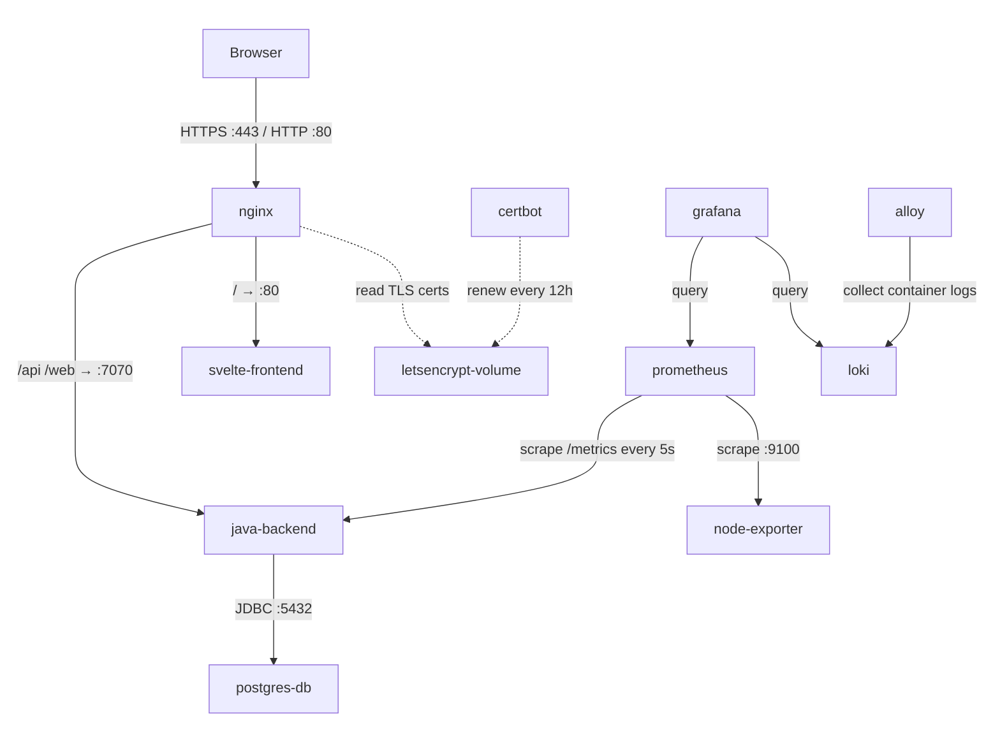

# MiniTwit

> A production microblogging application — live under continuous simulator load at **[zerodt.live](https://zerodt.live)**

[](https://zerodt.live)
[](https://github.com/ZeroDownTime-ITU/minitwit_project/releases/latest)
[](https://github.com/ZeroDownTime-ITU/minitwit_project/actions/workflows/continous-deployment.yml)

---

## Overview

MiniTwit is a microblogging application built and operated as part of the MSc DevOps course at IT University of Copenhagen. It runs live at [zerodt.live](https://zerodt.live) under continuous load from a course-operated simulator that registers users, posts messages, and queries the API around the clock. The project covers the full DevOps lifecycle: automated CI/CD, containerised deployment, infrastructure-as-code, and production observability.

---

## Architecture



Incoming traffic hits nginx, which terminates TLS (Let's Encrypt, HTTP/2) and routes requests: `/` to the Svelte static frontend, `/api` and `/web` to the Java backend, and `/grafana/` to the Grafana instance. The Java backend connects to PostgreSQL over JDBC. Prometheus scrapes the Java app's `/metrics` endpoint every 5 seconds and the host via node_exporter. Grafana Alloy tails Docker container logs and ships them to Loki; Grafana queries both Prometheus and Loki for dashboards and log exploration.

---

## Tech Stack

| Component | Technology |
|---|---|
| Backend | Java 21, Javalin 7, jOOQ, HikariCP |
| Frontend | SvelteKit 2, Svelte 5, TypeScript, TailwindCSS 4 |
| Database | PostgreSQL 15 |
| Reverse Proxy | nginx (Alpine), HTTP/2, Let's Encrypt TLS |
| Containerisation | Docker, Docker Compose |
| CI/CD | GitHub Actions — test, tag, build, push, deploy |
| Observability | Prometheus, Grafana, Loki, Grafana Alloy |
| Code Quality | SonarCloud, Codacy |
| Infrastructure | Vagrant, DigitalOcean (Droplets + Block Storage) |

---

## Getting Started

### Prerequisites

- Docker ≥ 24 and Docker Compose V2
- Java 21 and Maven 3.9+ (to run tests outside Docker)
- Vagrant + `vagrant-digitalocean` plugin (cloud deployment only)

### Run locally with Docker Compose

```bash
git clone https://github.com/ZeroDownTime-ITU/minitwit_project.git
cd minitwit_project
docker compose up --build
```

| Service | URL |
|---|---|
| Frontend (Vite dev server) | http://localhost:5173 |
| Backend API | http://localhost:7070 |
| Prometheus | http://localhost:9090 |
| Grafana | http://localhost:3000 |

The local stack uses hardcoded dev credentials, hot-reload for the Svelte frontend, and exposes port `5005` for Java remote debugging (attach with any JDWP-compatible debugger).

### Run tests

```bash
cd minitwit-java
mvn test
```

The test suite uses an H2 in-memory database and covers: user registration, login/logout, message posting, timeline behaviour (public vs. user), authorisation enforcement, and 404 handling.

### Deploy to DigitalOcean with Vagrant

```bash
export DIGITAL_OCEAN_KEY=<your-do-token>
export SSH_KEY_NAME=<your-do-ssh-key-name>

# Copy and fill in credentials
cp remote_files/.env.template remote_files/.env

vagrant up minitwit
```

`provision.sh` runs automatically and:
1. Installs `doctl` and assigns the reserved IP to the droplet
2. Mounts the persistent DO Block Storage volume
3. Creates data directories for Postgres, Prometheus, Grafana, and Loki with correct ownership
4. Installs Docker and starts all services via `docker compose up -d`
5. Requests a Let's Encrypt certificate via Certbot (skipped if certs already exist on the volume)
6. Swaps nginx to the HTTPS config and reloads it
7. Installs and starts Prometheus `node_exporter` as a systemd service

A `test` VM is also defined (`vagrant up test`) — a smaller `s-1vcpu-1gb` staging droplet at `minitwit.app`.

---

## CI/CD Pipeline

Two GitHub Actions workflows trigger on pushes to `main` or `master`.

### `continous-deployment.yml`

Triggers when changes land in `minitwit-java/`, `minitwit-svelte/`, `monitoring/prometheus/`, or `remote_files/`. Also supports manual dispatch.

**Job: tag**
Reads the latest `v*.*.*` git tag (defaulting to `v0.0.0`) and bumps the version based on commit message keywords:

| Keyword in commit message | Version bump |
|---|---|
| `#major` | `v1.2.3` → `v2.0.0` |
| `#minor` | `v1.2.3` → `v1.3.0` |
| *(anything else)* | `v1.2.3` → `v1.2.4` |

Creates a git tag and a GitHub release with auto-generated release notes.

**Job: build** (runs after tag)
1. Sets up JDK 21 (Temurin distribution)
2. Runs `mvn test` — the pipeline fails here if any test breaks
3. Builds and pushes three Docker images to Docker Hub (`despotheanimal/` org), tagged with both `:latest` and the new semver tag:
   - `minitwit-java`
   - `minitwit-svelte`
   - `minitwit-prometheus`
4. Uses Docker Buildx with registry-layer caching for faster subsequent builds
5. SSHs into the production server and runs `VERSION=<new_tag> /minitwit/deploy.sh`

`deploy.sh` writes the new version to `.env`, pulls the updated images, and restarts `java-backend`, `svelte-frontend`, `nginx`, and `prometheus`.

A migration to Docker Swarm for zero-downtime rolling deployments is currently underway.

### `sonar.yml`

Triggers on push to `main`/`master` and on all pull requests. Runs SonarCloud static analysis (`mvn sonar:sonar`) against the `zerodowntime-itu` organisation.

---

## Observability

### Metrics

Prometheus scrapes two targets:

- **`java-backend:7070/metrics`** (every 5 s) — JVM heap, GC pause times, thread count, HikariCP connection pool, and custom Javalin request counters and latency histograms
- **`172.17.0.1:9100`** (Docker bridge gateway) — host-level CPU, memory, disk, and network via `node_exporter`

### Dashboards

Grafana is provisioned with four dashboards at startup:

| Dashboard | What it shows |
|---|---|
| HTTP Requests | Request rate, latency, status codes by endpoint |
| JVM Resources | Heap memory, GC pause times, thread count |
| PostgreSQL Database | Query rate, connection pool usage |
| Server Health | CPU, memory, and disk utilisation |

### Logs

Grafana Alloy runs as a sidecar container, discovers all Docker containers via the Docker socket, and ships their logs to Loki. Grafana's Explore view can query logs by container name alongside metrics.

Dashboards and logs are accessible at **https://zerodt.live/grafana/**.

### API docs

Swagger UI is available at **https://zerodt.live/swagger** and the raw OpenAPI spec at **https://zerodt.live/openapi**.

---

## Project Structure

```
minitwit_project/
├── minitwit-java/          # Javalin backend (Java 21)
│   ├── src/main/java/      # Controllers, services, repositories, DTOs, jOOQ generated layer
│   ├── src/test/java/      # Integration tests (JUnit 5 + H2 in-memory DB)
│   ├── Dockerfile          # Multi-stage: Maven build → eclipse-temurin:21-jre
│   └── pom.xml
├── minitwit-svelte/        # SvelteKit frontend (TypeScript, TailwindCSS 4)
│   ├── src/                # Routes, feature components, bits-ui component library
│   ├── Dockerfile          # Multi-stage: Node 20 build → nginx:alpine
│   └── package.json
├── monitoring/
│   └── prometheus/         # Custom Prometheus image with baked-in prometheus.yml
├── remote_files/           # Files rsynced to the production server via Vagrant
│   ├── docker-compose.yml  # Production stack (9 services)
│   ├── deploy.sh           # Deployment script invoked by CI
│   ├── nginx-ssl.conf      # HTTPS + HTTP/2 nginx config (domain-templated)
│   ├── nginx-http.conf     # HTTP-only bootstrap config (used before certs exist)
│   └── monitoring/         # Alloy config, Grafana datasource and dashboard provisioning
├── diagrams/               # Architecture and ER diagrams (SVG)
├── docker-compose.yml      # Local development stack (hot reload, debug ports)
├── Vagrantfile             # DigitalOcean provisioning — prod and test VMs
└── provision.sh            # Server bootstrap script (Docker, certs, node_exporter)
```

---

## Team

**ZeroDownTime** — MSc DevOps, IT University of Copenhagen, Spring 2026

- Corbijn Bulsink
- Mathias Søgaard
- Magnus Bergstedt
- Kasper Larsson
- Ymir Arnarson
